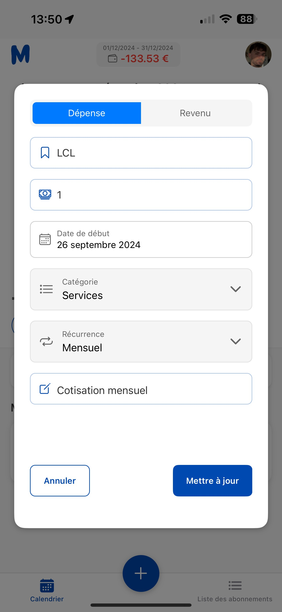
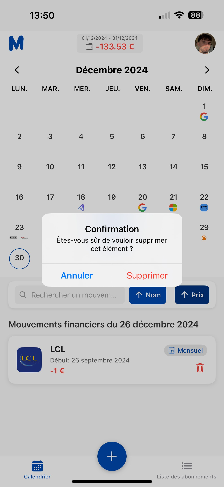
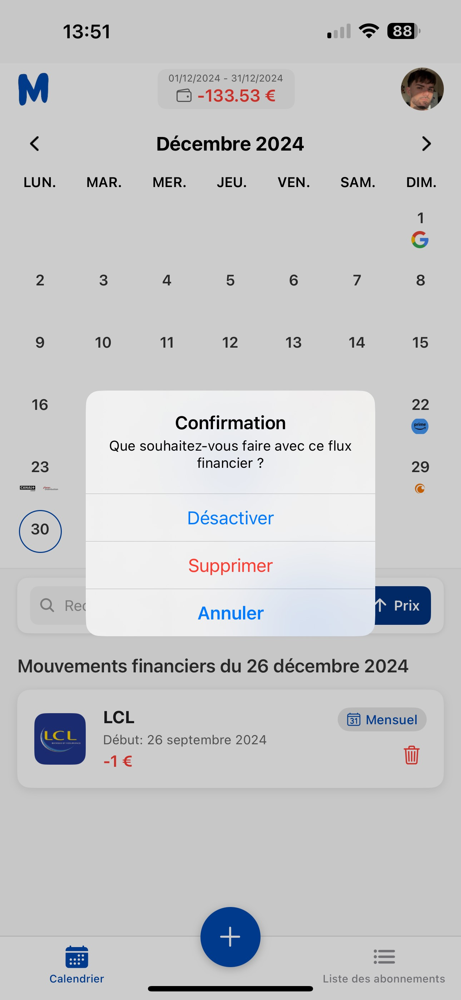

# MoneyTrak - Tutoriel de l'application

MoneyTrak est une application de gestion des abonnements et des dépenses. Ce guide vous accompagnera à travers les différentes fonctionnalités de l'application, avec des captures d'écran pour chaque section. Vous y trouverez tout ce dont vous avez besoin pour commencer à suivre vos finances et gérer vos abonnements efficacement.

## Télécharger l'application

Pour télécharger l'application **MoneyTrak**, suivez les étapes ci-dessous :

### Sur Android

1. **Télécharger le fichier APK** :
   - [Téléchargez le fichier **MoneyTrak.apk** ici](./MoneyTrak.apk).
   - Ouvrez le fichier téléchargé pour installer l'application.

### Sur iOS

Pour installer **MoneyTrak** sur votre iPhone ou iPad, vous pouvez utiliser **AltStore**, une application qui permet d'installer des applications non disponibles sur l'App Store sans nécessiter de jailbreak.

**Étapes pour installer AltStore et MoneyTrak sur iOS** :

1. **Télécharger et installer AltServer sur votre ordinateur** :
   - Rendez-vous sur le site officiel d'AltStore : [https://altstore.io/](https://altstore.io/)
   - Téléchargez la version d'AltServer correspondant à votre système d'exploitation (macOS ou Windows).
   - Installez AltServer en suivant les instructions fournies sur le site.

2. **Préparer votre iPhone ou iPad** :
   - Connectez votre appareil iOS à votre ordinateur à l'aide d'un câble USB.
   - Assurez-vous que votre appareil est déverrouillé et que vous avez sélectionné "Faire confiance à cet ordinateur" si cela vous est demandé.

3. **Installer AltStore sur votre appareil iOS** :
   - Lancez AltServer sur votre ordinateur.
   - Cliquez sur l'icône AltServer dans la barre des tâches (Windows) ou la barre de menus (macOS).
   - Sélectionnez "Install AltStore" et choisissez votre appareil iOS.
   - Entrez votre identifiant Apple et votre mot de passe lorsque cela vous est demandé.
   - Une fois l'installation terminée, l'application **AltStore** apparaîtra sur votre appareil iOS.

4. **Faire confiance au certificat de l'application AltStore** :
   - Sur votre appareil iOS, allez dans **Réglages** > **Général** > **Gestion des profils et de l'appareil**.
   - Sélectionnez le profil associé à votre identifiant Apple et appuyez sur "Faire confiance".

5. **Installer l'application MoneyTrak via AltStore** :
   - [Téléchargez le fichier **MoneyTrak.ipa** ici](./MoneyTrak.ipa).
   - Ouvrez l'application **AltStore** sur votre appareil iOS.
   - Appuyez sur l'onglet "My Apps" (Mes applications).
   - Appuyez sur le bouton "+" en haut à gauche et sélectionnez le fichier **MoneyTrak.ipa** que vous avez téléchargé.
   - L'application **MoneyTrak** sera installée sur votre appareil iOS.

**Remarque** : Les applications installées via AltStore sont valides pendant 7 jours. Pour les renouveler, ouvrez AltStore sur votre appareil iOS et connectez-vous à AltServer sur votre ordinateur.

---

## 1. Connexion et inscription

### Page d'inscription

La première page de l'application permet à l'utilisateur de s'inscrire en fournissant les informations suivantes :
- **Prénom**
- **Nom**
- **Email**
- **Nom d'utilisateur**
- **Mot de passe** (avec option de visualiser le mot de passe)
- **Confirmation du mot de passe**

L'utilisateur peut ensuite cliquer sur le bouton **S'inscrire** pour compléter l'inscription. Si l'utilisateur a déjà un compte, il peut se connecter via le lien **Se connecter** situé en bas de la page.

  

### Page de connexion

La page de connexion permet à l'utilisateur de se connecter à son compte en renseignant son **Nom d'utilisateur** et son **Mot de passe**. L'utilisateur peut également afficher le mot de passe en cliquant sur l'icône appropriée.

Une fois les informations saisies, l'utilisateur peut appuyer sur le bouton **Se connecter** pour accéder à l'application. Si l'utilisateur n'a pas encore de compte, il peut créer un compte via le lien **S'inscrire** en bas de la page.

  

---

## 2. Navigation dans l'application

### Page d'accueil centrée sur le jour actuel

La page d'accueil de l'application affiche un calendrier avec le mois en cours. La date actuelle est mise en évidence et l'utilisateur peut voir ses mouvements financiers associés à ce jour. En haut de l'écran, un résumé des finances du mois est affiché (dans ce cas, un solde de **-133,53 €**).

L'utilisateur peut également :
- Rechercher un mouvement financier à l'aide du champ de recherche.
- Visualiser les mouvements financiers pour la journée sélectionnée.
- Ajouter un mouvement financier en cliquant sur le bouton **+** situé en bas de l'écran.

Les icônes en bas permettent de naviguer entre les différentes sections de l'application, comme le **Calendrier** et la **Liste des abonnements**.

  

### Réglage du jour de début du mois

Sur la page d'accueil, l'utilisateur peut ajuster le calcul du total des dépenses mensuelles en sélectionnant le **jour de début du mois**. Cela permet de définir à partir de quel jour le calcul des flux financiers sera effectué pour ce mois-ci.

Un calendrier s'affiche, et l'utilisateur peut choisir le jour à partir duquel il souhaite commencer le calcul des dépenses mensuelles. Une fois le jour sélectionné, l'utilisateur peut fermer la fenêtre avec le bouton **Fermer**.

Cela permet de personnaliser le calcul des dépenses, par exemple si les dépenses sont calculées à partir du 15 du mois plutôt que du 1er.

  

### Exemple d'un jour précédent avec des abonnements ajoutés

Sur la page d'accueil, si l'utilisateur sélectionne un jour précédent, il peut voir les mouvements financiers associés à ce jour. Dans cet exemple, le **23 décembre 2024**, deux abonnements sont listés :  
- **Canal +** (abonnement de **19,49 €**)
- **Free mobile** (abonnement de **30 €**)

Ces abonnements sont identifiés comme des paiements récurrents, marqués avec l'icône **Mensuel**. L'utilisateur peut également supprimer un abonnement en cliquant sur l'icône de la corbeille à côté de chaque élément.

  

---

## 3. Gestion des abonnements et flux financiers

### Pages des flux financiers

La page des flux financiers permet à l'utilisateur de visualiser tous ses abonnements sous forme de liste. Les mouvements financiers sont organisés par date, avec un résumé pour chaque abonnement incluant le nom du service, la date de début, et le montant associé. Dans cet exemple, les abonnements suivants sont affichés :
- **Google One** (1er décembre 2024, **-1.99 €**)
- **Cursor AI** (18 décembre 2024, **-21.13 €**)
- **Microsoft** (21 décembre 2024, **-11.99 €**)
- **Amazon Prime** (23 décembre 2024, **-5.99 €**)

Les utilisateurs peuvent filtrer les abonnements en fonction de différents critères via les onglets en haut de l'écran : **Tous**, **Dépenses**, et **Revenus**. De plus, chaque abonnement est marqué comme **Mensuel** ou **Annuel**, et peut être supprimé en cliquant sur l'icône de la corbeille à côté de l'abonnement.

  

### Page d'ajout d'un flux financier

La page d'ajout d'un flux financier permet à l'utilisateur d'ajouter une nouvelle dépense ou un revenu. Les informations suivantes doivent être fournies :
- **Nom** du flux (par exemple, l'abonnement ou le revenu).
- **Montant** de la dépense ou du revenu.
- **Date de début** du flux (exemple : 30 décembre 2024).
- **Catégorie** (comme "Autres dépenses" ou d'autres catégories prédéfinies).
- **Récurrence** (Mensuel, Annuel, etc.).
- **Description optionnelle** pour fournir plus de détails sur le flux.

Une fois toutes les informations saisies, l'utilisateur peut cliquer sur le bouton **Ajouter** pour enregistrer le flux financier.

  

### Mise à jour d'un abonnement

L'utilisateur peut mettre à jour un abonnement existant en accédant à la page d'édition de l'abonnement. Ici, l'utilisateur peut modifier le **nom**, le **montant**, la **date de début**, la **catégorie**, la **récurrence**, et la **description** de l'abonnement. Une fois les modifications apportées, il suffit de cliquer sur le bouton **Mettre à jour** pour enregistrer les changements.

  

### Suppression ou désactivation d'un abonnement

L'utilisateur peut supprimer un abonnement de façon permanente ou désactiver un abonnement pour l'historique.  
1. **Suppression d'un abonnement** : Si l'utilisateur souhaite supprimer un abonnement (par exemple, en cas d'erreur), une confirmation est demandée avant de supprimer l'élément.
   - L'utilisateur verra un message de confirmation lui demandant s'il est sûr de vouloir supprimer l'élément.
   - Après confirmation, l'abonnement sera définitivement supprimé.

  

2. **Désactivation d'un abonnement** : Si l'utilisateur souhaite désactiver un abonnement (pour garder un historique sans qu'il soit pris en compte pour les futurs calculs), un autre message de confirmation apparaît pour demander s'il veut **désactiver** l'abonnement.

  

---

## 4. Personnalisation du profil

### Page de profil

La page de profil permet à l'utilisateur de voir et gérer ses informations personnelles. Elle affiche :
- **Nom d'utilisateur** et photo de profil.
- **Informations sur l'inscription**, incluant la date d'inscription à MoneyTrak.
- Le nombre d'**abonnements** et de **sources de revenus**.

L'utilisateur peut :
- Modifier son profil en cliquant sur le bouton **Éditer le profil**.
- Changer son mot de passe via le lien **Changer le mot de passe**.
- Se **déconnecter** de son compte avec le bouton **Se déconnecter** en bas de la page.

  

### Page d'édition du profil

La page d'édition du profil permet à l'utilisateur de mettre à jour ses informations personnelles. L'utilisateur peut modifier les champs suivants :
- **Prénom**
- **Nom**
- **Email**
- **Nom d'utilisateur**

Une fois les modifications effectuées, l'utilisateur peut enregistrer les changements en cliquant sur le bouton **Enregistrer les modifications**. Si l'utilisateur souhaite annuler les changements, il peut appuyer sur le bouton **Annuler**.

  

### Page de changement de mot de passe

La page de changement de mot de passe permet à l'utilisateur de mettre à jour son mot de passe. L'utilisateur doit entrer :
- **Mot de passe actuel** pour confirmer son identité.
- **Nouveau mot de passe** qu'il souhaite définir.
- **Confirmation du nouveau mot de passe** pour s'assurer que le mot de passe est correctement saisi.

Une fois les champs remplis, l'utilisateur peut valider le changement en cliquant sur le bouton **Valider**. Si l'utilisateur souhaite annuler cette opération, il peut cliquer sur le bouton **Annuler** en bas de la page.

  

---

Si vous avez des questions supplémentaires ou des suggestions, n'hésitez pas à nous contacter via [lucasb0695@gmail.com](mailto:lucasb0695@gmail.com).

---

Vous pouvez consulter la liste complète des rapports de bugs et des évolutions pour l'application MoneyTrak via ce [lien vers le document Google Sheets](https://docs.google.com/spreadsheets/d/1bIyirsWe-3wvHNZ2aqyIoH7-pT10mI9iK2VtLsBjDIo/edit?usp=sharing).
